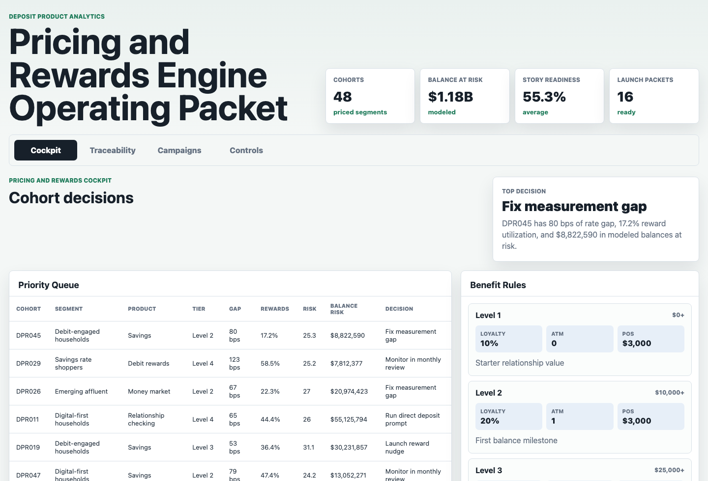
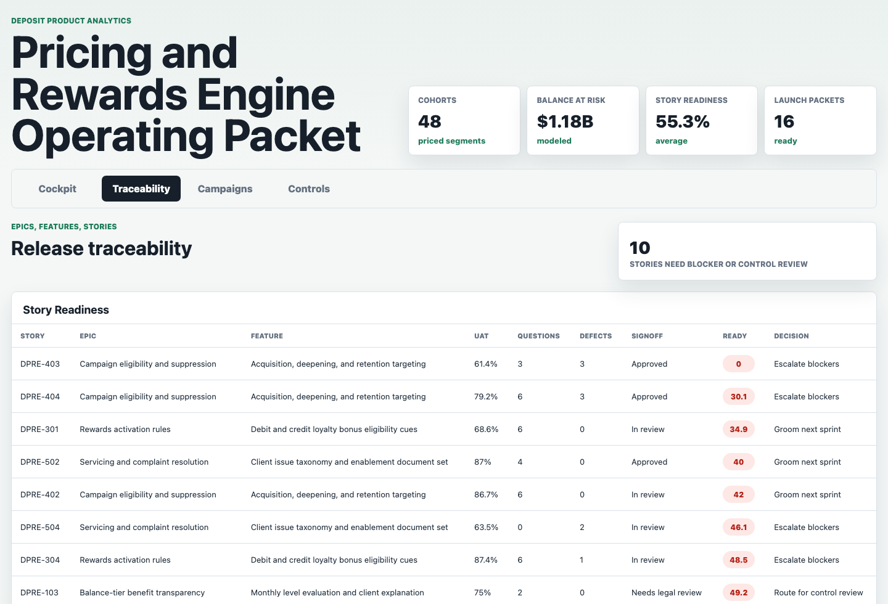
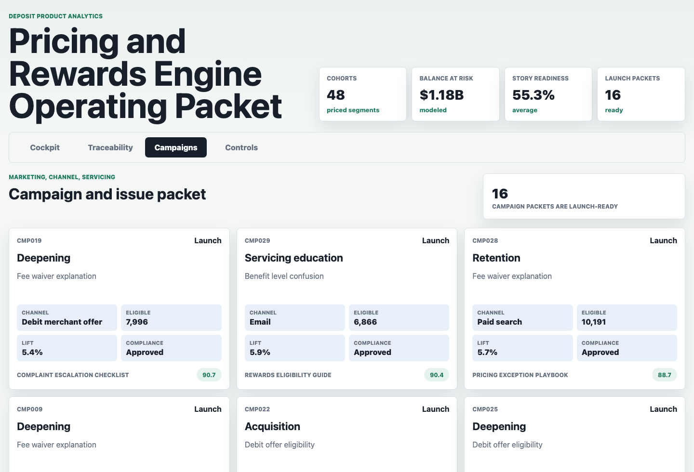
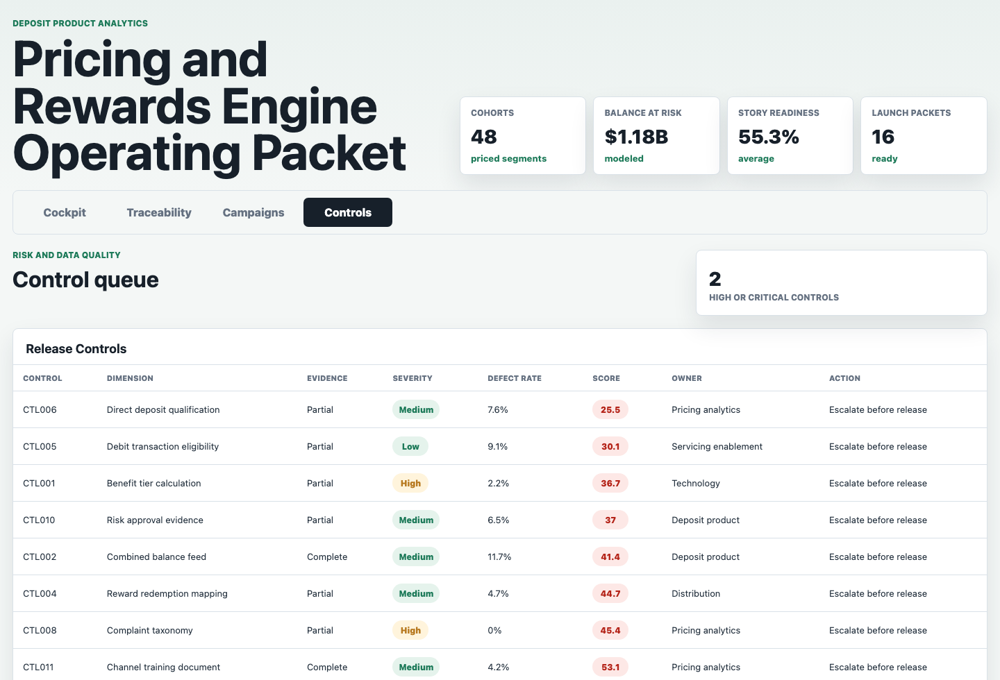

# Deposit Pricing Rewards Product Analytics Lab

An interactive product analyst operating packet for a retail banking deposit pricing and rewards engine team. The artifact connects deposit cohort analytics, balance-tier benefit logic, pricing gaps, rewards utilization, campaign readiness, complaint drivers, epic and story traceability, UAT evidence, and risk-control review.

The practical product question is: which deposit pricing or rewards enhancement should move into the next cross-functional review, what user stories and evidence are needed, and which marketing, servicing, legal, risk, compliance, analytics, technology, and distribution partners need to act?

## Screenshots



**Pricing and rewards cockpit:** Ranks synthetic deposit cohorts by rate gap, rewards utilization, complaint rate, modeled balances at risk, data quality, control readiness, and recommended product decision.



**Epic and story traceability:** Converts pricing and rewards opportunities into epics, features, user stories, acceptance criteria, UAT pass rates, dependencies, partner signoff, and release decisions.



**Campaign and issue packet:** Turns acquisition, deepening, retention, debit engagement, and servicing education opportunities into channel-ready campaign packets with eligibility, suppression, expected lift, complaint driver, enablement document, compliance status, and launch decision.



**Risk and data controls:** Surfaces the product, data, risk, compliance, disclosure, channel training, and UAT controls that can block a pricing or rewards release.

## What This Demonstrates

- Translating deposit product and pricing opportunities into epics, features, user stories, acceptance criteria, and UAT evidence.
- Using cohort analytics to recommend pricing tests, rewards activation, direct deposit prompts, measurement fixes, and monthly review items.
- Connecting marketing, channel, complaints, servicing enablement, legal, risk, compliance, analytics, technology, operations, and distribution partners into one product review packet.
- Separating business opportunity from data-quality and risk-control blockers.
- Communicating tradeoffs with an explainable scoring model instead of a black-box prediction.

## Data Strategy

The data is synthetic because real bank account behavior, pricing tests, rewards rules, campaign response, complaints, backlog items, UAT evidence, and risk approvals are confidential. The synthetic model is generated with fixed seed `20260529` by `scripts/score_operating_data.py`.

The structure is modeled on public retail banking mechanics and common deposit product workflows:

- Balance-linked benefit levels with monthly evaluation, loyalty bonus tiers, ATM waivers, and card limits.
- Deposit cohorts by product, market, customer segment, balance tier, APY, competitor APY, direct deposit adoption, rewards utilization, debit engagement, complaint rate, data quality, and control readiness.
- Product backlog traceability across epics, features, user stories, acceptance criteria, UAT pass rate, partner signoff, dependencies, and defects.
- Campaign and issue resolution packets across acquisition, deepening, retention, debit engagement, servicing education, channel execution, suppression logic, and disclosure review.
- Risk and data controls for benefit-tier calculation, combined balance feeds, reward redemption mapping, campaign suppression, complaint taxonomy, legal disclosure version, risk approval evidence, channel training, and UAT traceability.

The scoring is explainable and product-facing. Cohort priority combines attrition risk, competitive rate gap, balances at risk, data quality, risk-control readiness, and rewards utilization. Story readiness combines UAT pass rate, acceptance criteria, dependencies, open questions, high-severity defects, partner signoff, data quality, and control scores. Campaign launch readiness combines expected lift, eligible accounts, suppression rate, compliance status, data quality, and risk control status.

## Repository Structure

| Path | Purpose |
|---|---|
| `index.html` | Static app shell with four product operating surfaces. |
| `src/app.js` | Loads the generated payload and renders cockpit, traceability, campaign, and control views. |
| `src/styles.css` | Responsive workbench styling. |
| `scripts/score_operating_data.py` | Deterministic synthetic data generator and scoring model. |
| `data/` | Source-style synthetic CSV tables. |
| `analysis/outputs/` | Ranked queues, app payload, and summary outputs. |
| `analysis/executive_findings.md` | Interview-ready findings and recommendation. |
| `analysis/analysis_plan.md` | Analytical workflow and generation summary. |
| `analysis/sql_checks.sql` | Example SQL checks for cohort, story, campaign, and risk-control review. |
| `docs/images/` | Rendered screenshots for the four workbench surfaces. |

## Analysis Outputs

- `analysis/outputs/cohort_priority_queue.csv`: Ranked deposit cohort pricing and rewards opportunity queue.
- `analysis/outputs/story_readiness_queue.csv`: Story-level backlog traceability and release decision queue.
- `analysis/outputs/campaign_decision_packet.csv`: Campaign and issue resolution packet.
- `analysis/outputs/risk_control_queue.csv`: Risk and data-control remediation queue.
- `analysis/outputs/app_payload.json`: Static JSON payload used by the app.
- `analysis/outputs/summary.json`: Portfolio metrics used in the app header.

## Role Connection

This artifact is designed for a deposit product analyst role that needs business analytics, product management, partnership-building, project management, risk awareness, and strong written communication. It shows how an analyst can move from client behavior and product signals to recommendations, backlog artifacts, campaign decisions, teammate enablement, and risk-controlled execution.

## Scope

This is a portfolio artifact, not a production pricing platform, rewards engine, campaign tool, risk system, complaint system, or source-of-record backlog. It does not process transactions, change rates, calculate real customer benefits, represent real bank performance, or use confidential account data.

It does show how a product analyst can structure deposit pricing and rewards work into a defensible operating packet that can be discussed in an interview.

## Run Locally

```bash
npm run analyze
npm start
```

Open `http://localhost:4173`.
